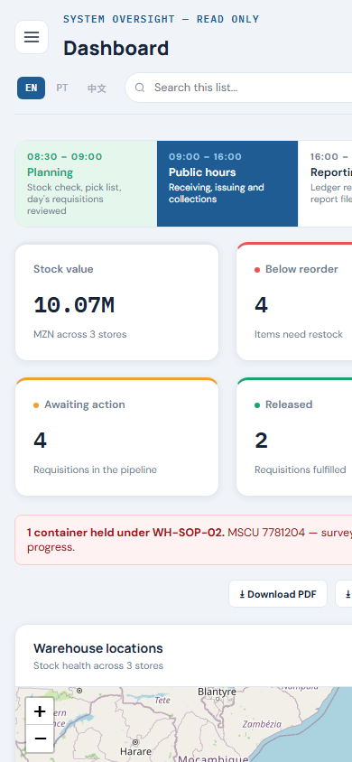
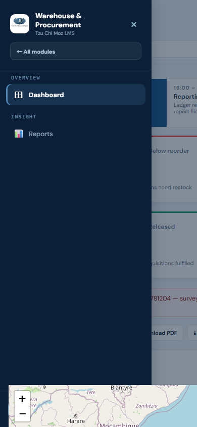
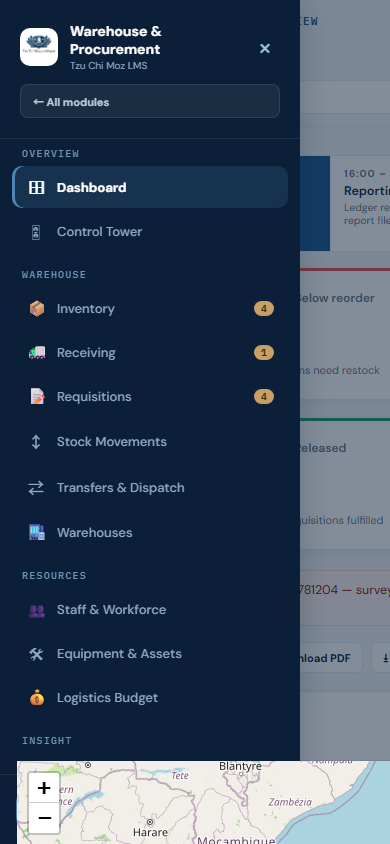
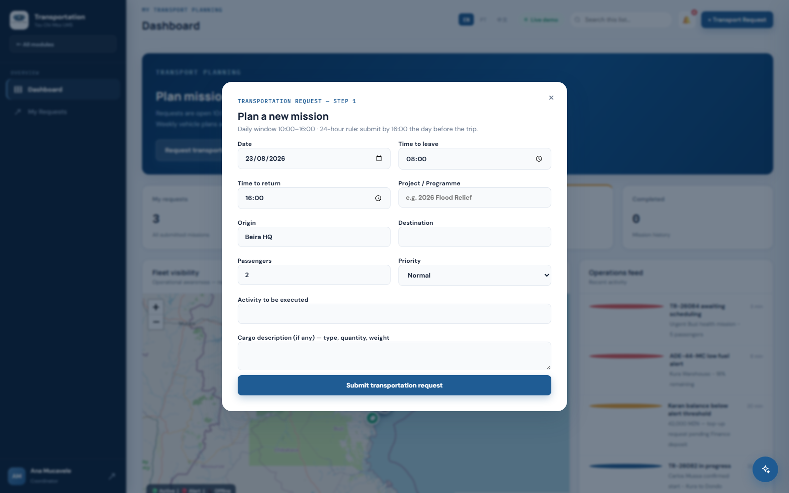

# Mobile layout QA — off-canvas sidebar drawer

How this was checked: no browser automation tool was available in the assistant
environment, so this wasn't verified by reasoning about CSS alone. A local static
server was started against this exact folder, and Google Chrome (already installed
on this machine) was driven headlessly at a real phone viewport (**390×844**, iPhone
12/13-class) to render the actual app and capture screenshots — not a mock-up.

Commit tested: `c36a818` — "Replace mobile horizontal-scroll nav with a proper
off-canvas sidebar drawer".

## 1. Dashboard, sidebar closed

Hamburger button (☰) visible top-left of the topbar. Page title, language switch and
search wrap onto their own rows instead of overflowing off-screen (the original bug
report).



## 2. Sidebar open — System Administrator (short nav)

Tapping ☰ slides the sidebar in from the left as a full-height overlay over a dimmed
backdrop, with an X to close it. Matches the pattern in the reference screenshots
(TCM-WMS) the user supplied — logo + org name at top, "← All modules", grouped nav
sections, active item highlighted.



## 3. Sidebar open — Logistics Department (full nav, scroll check)

Confirms the longer nav list (Dashboard, Control Tower, Inventory, Receiving,
Requisitions, Stock Movements, Transfers & Dispatch, Warehouses, Staff & Workforce,
Equipment & Assets, Logistics Budget, and more below the fold) scrolls inside the
drawer without breaking the fixed header/footer.



## Result

**Pass.** The drawer opens, closes (X / backdrop tap / picking a nav item), and
scrolls as expected at phone width. Desktop layout (sidebar permanently docked) is
untouched — this only changes behaviour under the 760px breakpoint.

## 4. Modal-over-map stacking bug

Separately reported: any modal opened over a screen containing a live Leaflet map
(e.g. "Request transportation" over the Coordinator dashboard's fleet map) had the
map's tiles and zoom controls bleeding through on top of the modal instead of
staying behind it. Root cause: Leaflet's internal panes use z-index up to 700
(popups), and `.map-wrap` had no CSS stacking context of its own, so those values
competed directly against the modal's z-index (20) at the page's root stacking
context instead of being contained within the map's own box.

Fix: `isolation: isolate` added to `.map-wrap` (styles.css) — traps all of Leaflet's
internal z-index values inside the map's own stacking context. Applies to every map
in the app, both modules, since `.map-wrap` is the one shared container class
(`T.fleetMapHTML`, `W.facilityMapHTML`).



## How to re-run this check

From `TZU CHI MOZ LMS V2/`:

```
python -m http.server 8935
```

Then open `http://localhost:8935/index.html` in a phone-width browser window (or
Chrome DevTools device toolbar, 390×844) and tap the ☰ icon after signing in.
